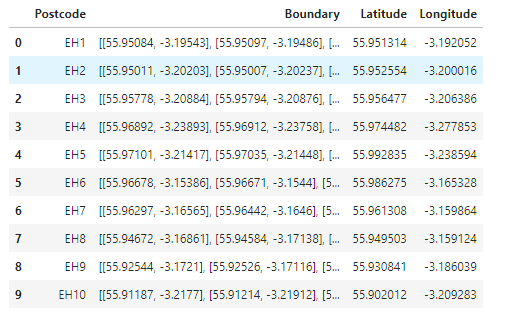
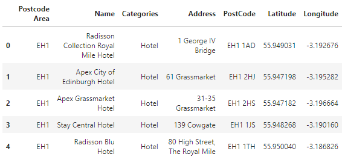
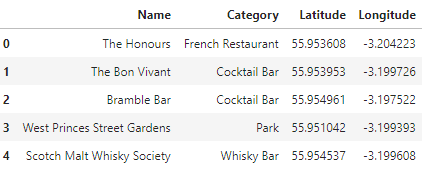

# Examining Hotel Locations in Edinburgh
## Introduction
This project examines the locations of hotels in the Edinburgh area and explores their relation to other venues in the city.
### Background
Edinburgh, the capital of Scotland, is a popular short break destination with a wide variety of historical and cultural highlights. The festival season during the summer sees up to 4 million visitors each year. With a population of close to half a million, there are many dining and leisure venues. In addition, there are a wide range of accomodation options situated across the city and surrounding towns from which visitors to the city can choose.
## Problem
With many visitors opting only for a short break, the choice of hotel location is an important one rasing several questions such as (i) is it close to many venues in the city, (ii) how do different locations compare to each other in terms of different nearby venues. Machine learning clustering techniques provide the means by which the distribution of hotels and venues can be clustered within the city for easy visualization on a map of the city.
## Interest
A means by which to characterise the locations of hotels in Edinburgh if of interest to several groups. First we can consider tourists who would like to explore a particular aspect of the city and would like to have accomodation within easy access of the sights that they wish to visit. Business visitors also have an interest in the location of hotels, but with different demands on the types of nearby venues. For example, a district close to many restaurants would likely be of more interest than one in the centre of many tourist attractions. The analysis in this project would also be of interest to hotelliers and the business community, in determing the best locations for new hotels and venues.

## Data Sources
The primary data source for this project is the Foursquare API. This will initially be used to obtain the hotels accross the city and wider area. As the API is optimized to obtain a relatively small number of nearby venues close to a given location, the hotels will be located according to their UK postal code area (e.g. EH1). This information can be found on the following Wikipedia page:

https://en.wikipedia.org/wiki/EH_postcode_area

The acutal data for this is contained in a KML ("Keyhole Markup Language") file:

https://en.wikipedia.org/w/index.php?title=Template:Attached_KML/EH_postcode_area&action=raw

This XML format file contains a series of points for each postal code area that define a polygon outlinining the postal code area. This data can be formated from the XML to obtain a dataframe containing the postcode and the boundary points. The KML format also contains the centroid for each region, which can also be appended to the dataframe. In addition, it is important to note that the KML has the latitude and longitude reversed, and to it is necessary to reverse these in order to properly plot the postcal code areas on the map op Edinburgh. The top of resulting dataframe is shown below:

Based on the centroid coordinates for each postcode area, the nearby hotels for each can be obatined from the foursquare API using the "search" endpoint with a query of "Hotel". For each hotel, the name, category, address, postcode, latitude and longitude can be obtained. By matching the postcode to the current postcode area, hotels from outside the current postcode can be excluded. Similarly, hotels with unknown postcode are removed during the extraction of data from the returned json. The top of the resulting dataframe is shown below:

For a particular location, the other venues nearby can be obtained from the FourSquare API using the "explore" endpoint. As the venues close to hotels are required, those with category "Hotel" are excluded from the returned venues. The names, categories, latitude and longitude can be obtained for each venue. In the project, the explore location is defined as the centre of a cluster of hotels, as determined by using the kmeans algorithm. The top of the resulting dataframe is shown below:

