# Examining Hotel Locations in Edinburgh
## Introduction
This project examines the locations of hotels in the Edinburgh area and explores their relation to other venues in the city.
### Background
Edinburgh, the capital of Scotland, is a popular short break destination with a wide variety of historical and cultural highlights. The festival season during the summer sees up to 4 million visitors each year. With a population of close to half a million, there are many dining and leisure venues. In addition, there are a wide range of accomodation options situated across the city and surrounding towns from which visitors to the city can choose.
## Problem
With many visitors opting only for a short break, the choice of hotel location is an important one rasing several questions such as (i) is it close to many venues in the city, (ii) how do different locations compare to each other in terms of different nearby venues. Machine learning clustering techniques provide the means by which the distribution of hotels and venues can be clustered within the city for easy visualization on a map of the city.
## Interest
A means by which to characterise the locations of hotels in Edinburgh if of interest to several groups. First we can consider tourists who would like to explore a particular aspect of the city and would like to have accomodation within easy access of the sights that they wish to visit. Business visitors also have an interest in the location of hotels, but with different demands on the types of nearby venues. For example, a district close to many restaurants would likely be of more interest than one in the centre of many tourist attractions. The analysis in this project would also be of interest to hotelliers and the business community, in determing the best locations for new hotels and venues.

## Data Sources
The primary data source for this project is the Foursquare API. This will initially be used to obtain the hotels accross the city and wider area. As the API is optimized to obtain a relatively small number of nearby venues close to a given location, the hotels will be located according to their UK postal code area (e.g. EH1). This information can be found on the following Wikipedia page:

https://en.wikipedia.org/wiki/EH_postcode_area

The acutal data for this is contained in a KML ("Keyhole Markup Language") file:

https://en.wikipedia.org/w/index.php?title=Template:Attached_KML/EH_postcode_area&action=raw

This XML format file contains a series of points for each postal code area that define a polygon outlinining the postal code area. This data can be formated from the XML to obtain a dataframe containing the postcode and the boundary points. The KML format also contains the centroid for each region, which can also be appended to the dataframe. In addition, it is important to note that the KML has the latitude and longitude reversed, and to it is necessary to reverse these in order to properly plot the postcal code areas on the map op Edinburgh. The top of resulting dataframe is shown below:

Based on the centroid coordinates for each postcode area, the nearby hotels for each can be obatined from the foursquare API using the "search" endpoint with a query of "Hotel". For each hotel, the name, category, address, postcode, latitude and longitude can be obtained. By matching the postcode to the current postcode area, hotels from outside the current postcode can be excluded. Similarly, hotels with unknown postcode are removed during the extraction of data from the returned json. The top of the resulting dataframe is shown below:

For a particular location, the other venues nearby can be obtained from the FourSquare API using the "explore" endpoint. As the venues close to hotels are required, those with category "Hotel" are excluded from the returned venues. The names, categories, latitude and longitude can be obtained for each venue. In the project, the explore location is defined as the centre of a cluster of hotels, as determined by using the kmeans algorithm. The top of the resulting dataframe is shown below:

## Methodology & Results
The data analysis and machine learning approaches used will be discussed

### Determining the postcode regions in Edinburgh
We begin by obtaining the postcode districts from the KML file using data scraping techniques. The file is read and the boundaries and centroid of each postcoderegion are extracted as shown in the table in the Data section. These are then plotted on map centered on the City of Edinburgh, based on the latitude and longitude returned by geocoder. The 54 postcode regions are shown on the map below:

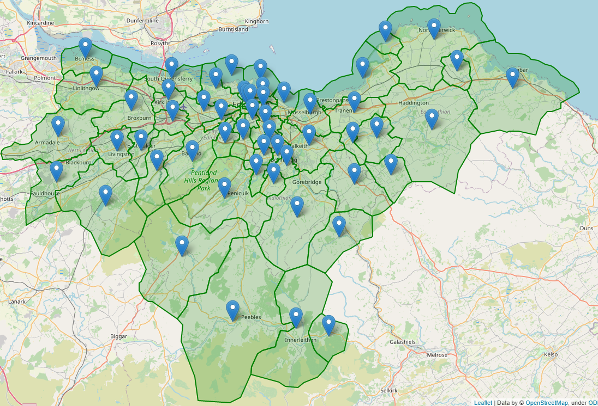

### Examining the hotel locations
The centroid coordinates for each postcode region are then used in a FourSquare API call using the search endpoint and query "Hotel". The results are shown in the table in the data section. In order to explore the hotels, the number of hotels per postcode region can be obtained by grouping the hotels according to postcode region. The 5 postcode regions with the largest number of hotels are shown in the table below:

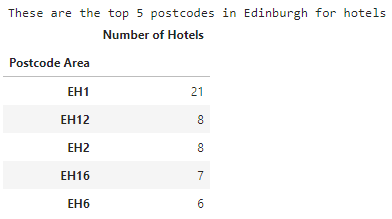

Most hotels are located in EH1, which is the city centre. The distribution of hotels can be viewed more conveniently on a bar plot, generated using seaborn and color coded according to the number of hotels:

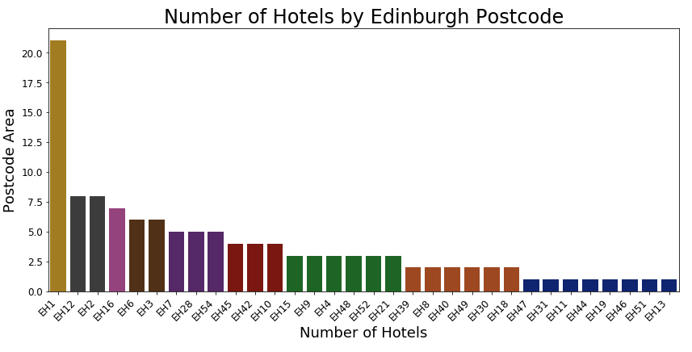

Although this shows us the distibution of hotels by postcode, the geographic location would be clearer on a map. We can use the coordinates of each hotel to plot a circle for each on the map of Edinburgh. Color coding the circles by postcode regions allows us to see clearly which hotels are located in each region:

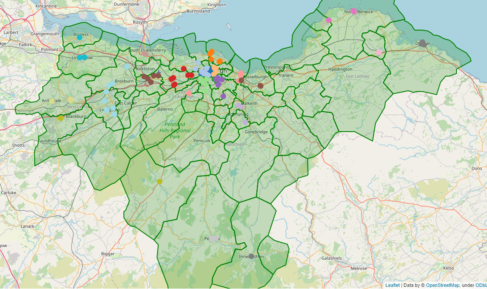

It is clear from the map that simply clustering the hotels by postcode is not appropriate and somewhat artificial. The city centre consists of several postcode regions although the hotels are actually in close proximity to each other. A better approach would be to cluster the hotels according to their actual geographic location. kmeans clustering can be used for this, using the latitude and longitude values for each hotel. In order to optimize the number of clusters, the model is run for a range of numbers of clusters, and the inertia and silhuette metrics used to assess the number of clusters. These are shown in the plots below:

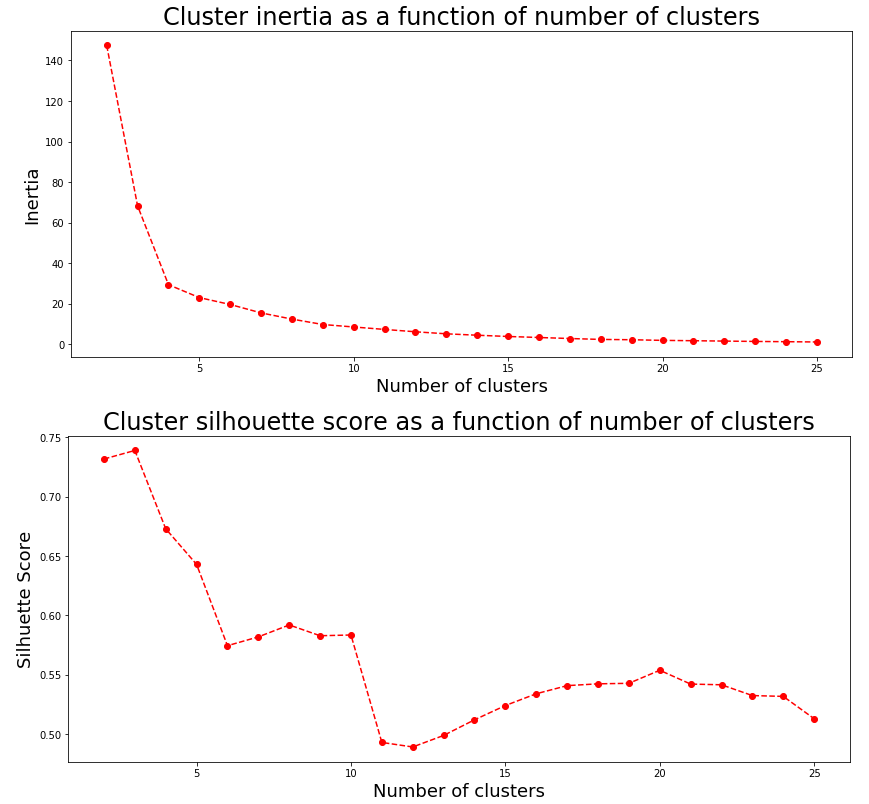

The elbow plot of the inertia as a function of the number of clusters shows an elbow at around 4 clusters, but there are further structures in the curve to higher number of clusters. This is apparent in the plot of the silhuette scores that shows that, although there is a large imporvement in the model at around 4-5 clusters, the model converges at around 11 clusters. The model is then re-run with 11 clusters, and the cluster labels applied to each hotel. The hotels are then re-plotted on the map of Edinburgh, color coded by cluster rather than postcode, along with the centroids of each cluster highlighted.

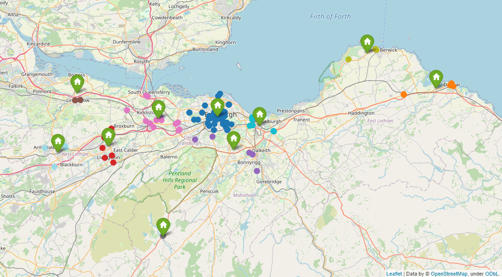

This appears much more reasonable. Hotels are clustered in the city centre as well as separate locations such as around the airport, the towns in the Pentland Hills, popular with hikers and the those around the costal towns to the east of the city. This clustering clearly groups hotels in a way that would be helpful to allow visitors to choose a hotel based on a particular location type.

### Exploring the venues close to each hotel cluster
In addition to the general geographic location of each hotel cluster, it is interesting to consider the other nearby venues for each. This may reveal similarities between hotels that are geographically distinct, providing further information of use to someone deciding where to stay in the Edinburgh region. In order to do this, each cluster is geographically located by its centroid and these used to obtain a list of venues for each cluster. A radius of 3 km is used to find the nearby venues. Hotels, hostels and bed and breakfast establishments are removed from the returned data as it is the venues around the accomodation that we are interedted in. The resulting dataframe is shown below:

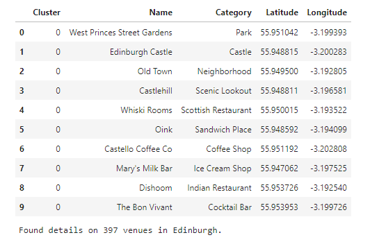

We can use the data for the hotels and venues in each cluster to compare the relationship between the two. The hotels and venues are grouped by cluster and counted, in order to obtain the number of each for each cluster. The resulting dataframe is used to generate the plot below:

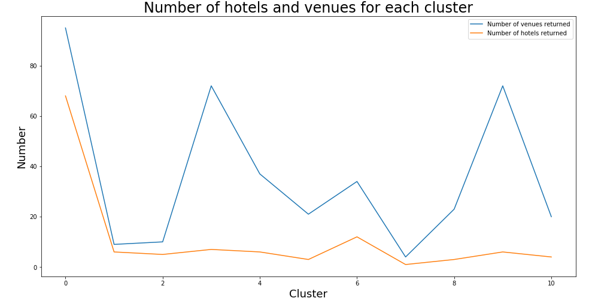

This plot suggests that regions with a higher density of hotels are associated with a higher density of other venues. Thus, there should be a greater choice of hotels in a region where there are lots of things to see and do. This can be highlighted by plotting the number of hotels versus the number of venues:

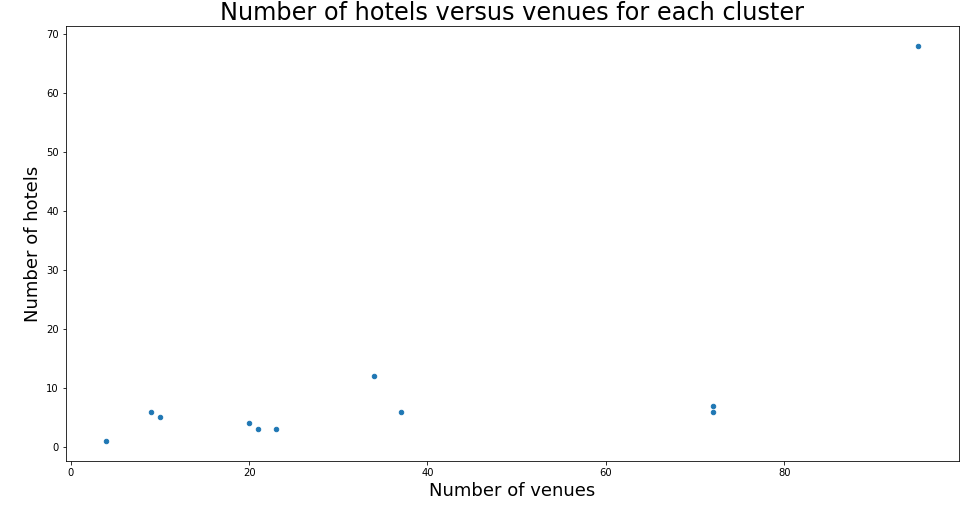

This plot shows a clear positive correlation between the number of hotels and venues, confirming the previous observation.

We now proceed to take the clusters and see if they can be clustered according to their venues. Naturally, the maximum number of clusters there can be is 11, the number of hotel clusters. If the optimum number of clusters is less than 11, this would suggest that sveral hotel clusters, while geographically distinct, show similarities in the types of venues present. Onehot coding is used to produce the features for the kmeans clustering. Before performing the clustering, the coded data can be used to see the 5 most common venue types for each hotel cluster

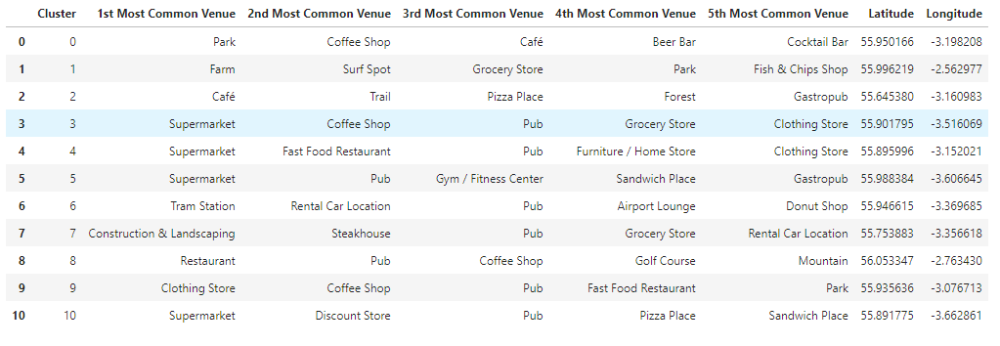

Already, the distribution of supermarkets and pubs suggests that there may be some similarity between some of the clusters. Performing the kmeans clustering for a number of clusters from 2 to 11 and considering the inertia and silhuette score metrics (plots in notebook) reveals that the optimum number of clusters is 6. This some hotel clusters are similar in terms of venues. We can now plot the hotels on the map of Edinburgh, but color coded in two ways. The outline of each circle indicates the hotel cluster as before, while the fill color relates to the second level clustering based on venues:

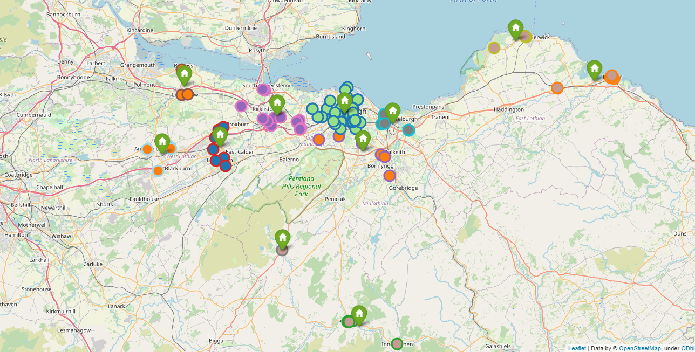

The clustering clearly shows that while some hotel clusters are geographically distinct, they are similar when taking into account the venues. For example, the towns in the Pentland hills and around the coast a somewhat similar. Likewise the out of town locations to the west of Edinburgh show some similarity. The information provided by this two level clustering provides a powerful means by which a visitor can choose a hotel based on general geographic location and type of nearby amenities

## Conclusion
k means clustering has been used to cluster the hotels in Edinburgh according to their geographic location and, at a second level, the types of venues in their vicinity. The two level clustering clearly shows that the hotels are more appropriately clustered by actual location than purely assigning them by postcode. Applying the venue information to each cluster shows similarities between venues, providing further information to guide a visitor looking to book a hotel. The analysis could be expanded further by considering the actual types of venues within each cluster, allowing a visitor to define particular wishes for their accomodation location. 